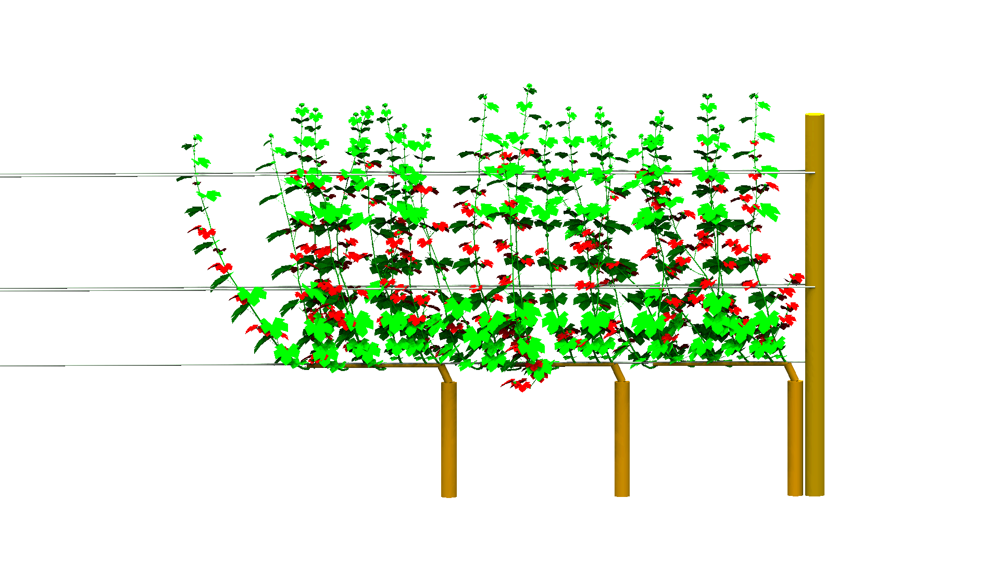

2021/09/08

#### Recent publication

Christopher Bahr, Dominik Schmidt, Matthias Friedel, Katrin Kahlen, Leaf removal effects on light absorption in virtual Riesling canopies (*Vitis vinifera* L.), *in silico Plants*, 2021; https://doi.org/10.1093/insilicoplants/diab027

{width=45%}{width=45%}

